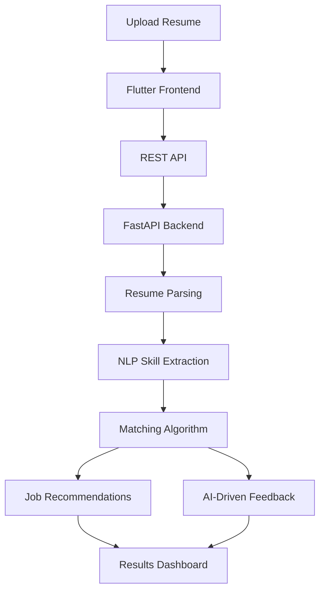

#  AI Resume Analyzer

### Analyze. Match. Improve. Get Hired.

An AI-powered full-stack application that analyzes resumes, extracts skills, matches candidates with relevant job opportunities, and provides intelligent feedback for resume improvement.

 

 

<a href="#features">Features</a> •
<a href="#how-it-works">How It Works</a> •
<a href="#tech-stack">Tech Stack</a> •
<a href="#application-preview">Application Preview</a> •
<a href="#future-scope">Future Scope</a>

---

## 📌 About the Project

**AI Resume Analyzer** is a full-stack application designed to simplify resume evaluation and job matching.

The system uses **Natural Language Processing (NLP)** techniques to analyze uploaded resumes, extract relevant skills, compare them with job requirements, calculate relevance scores, and provide personalized job recommendations and AI-driven feedback.

---

## ✨ Features 

🔍 **Resume Analysis**
Automatically parses uploaded resumes and extracts relevant information.

🧠 **NLP-Based Skill Extraction**
Identifies technical and professional skills from resume content.

🎯 **Job Matching**
Compares extracted skills with job requirements to identify suitable opportunities.

📊 **Relevance Scoring**
Calculates compatibility scores between candidate profiles and job requirements.

💡 **Skill Gap Identification**
Highlights missing skills and areas for professional improvement.

💼 **Job Recommendations**
Suggests suitable job opportunities based on the candidate's skills.

🤖 **AI-Driven Feedback**
Provides intelligent suggestions for improving resume quality and job readiness.

⚡ **Real-Time Analysis**
Uses REST APIs for seamless communication between the Flutter frontend and FastAPI backend.

---

## 🔄 How It Works

The AI Resume Analyzer follows an end-to-end processing pipeline that transforms an uploaded resume into personalized job recommendations and actionable feedback.

---

## 🛠️ Tech Stack

| Technology | Purpose                             |
| ---------- | ----------------------------------- |
| Flutter    | Cross-platform frontend development |
| Dart       | Frontend programming language       |
| FastAPI    | Backend API development             |
| Python     | Backend processing and NLP          |
| NLP        | Resume parsing and skill extraction |
| REST API   | Frontend-backend communication      |

---

## 📱 Application Preview

---

## 🎯 Future Scope

* 📄 Advanced ATS compatibility scoring
* 🌐 Integration with real-time job platforms
* 🤖 Advanced AI-powered resume suggestions
* 🗺️ Personalized career roadmaps
* 📊 Enhanced resume analytics
* 🧠 Machine learning-based job role prediction

